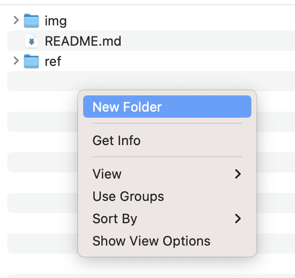

# frontend-planning
Planning our frontend

### Method:
1) create a folder in the same location as `ref/` with your name (e.g. `remy/`)
    <p align="center">
    
    </p>

2) copy-paste the the versioned directory you want to give feeback for from `ref` into your directory
    - If you want you give feedback on:
        ```sh
        ref/v1/Summoner_app.pptx
        ```
        then you the folder `v1/` to your directory (e.g. `remy/v1/`). Then, you should have 
        ```sh
        remy/v1/Summoner_app.pptx
        ```
    - Only copy-paste the version for which you want to give feeback for;

3) Add your feedback in your the document (e.g. `remy/v1/Summoner_app.pptx`).

4) Make sure you report your feedback in the `readme.md` present in your directory using the feedback template.
