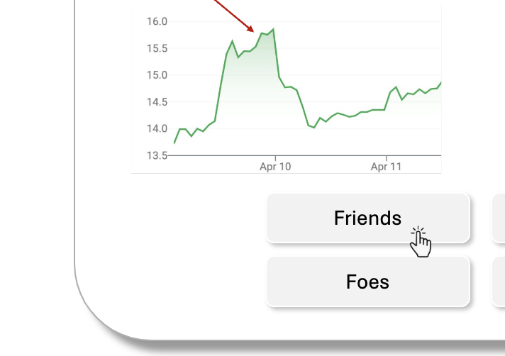

# V1

## Template for structured feedback

_List every feedback as a bullet point using the format below:_

#### [Document name here] 

- **[slide]** mention name of the feature AND slide number:
    
    - **[sub]** mention the name of subfeature OR button OR visual
        - **feedback #1**:
            - give a description of your feedback and/or what you added to the slide
            - don't hesitate to give reasons
            - add screenshots if you want (store all your screenshots in `img/`)
                

                
                

        - **feedback #2**:
            - give a description of your feedback and/or what you added to the slide
            - don't hesitate to give reasons
            - add screenshots if you want (store all your screenshots in `img/`)
                

                
                

        - ...
    