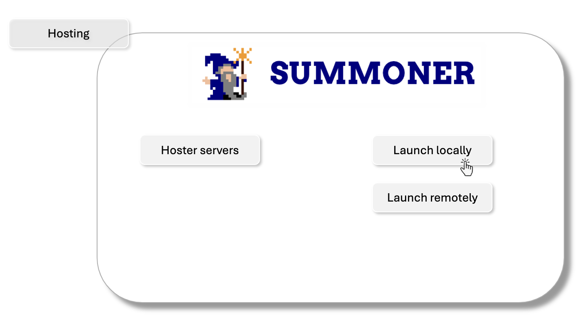

# V1

## 📝 Template for Structured Feedback

_List each piece of feedback as a bullet point using the format below:_

---

### 🔹 **[Summoner_app.pptx](Summoner_app.pptx)**

- **[Slide]**: `Hosting – Slides 19-21`

    - **[Sub]**: Hosting should have a subpage with three buttons: 
      - `Hosted servers`, 
      - `Launch a local server`, 
      - `Launch a remote server`.
        

        
        

      
        - **Feedback #1**  
            - `Hosted servers` should have the list of all server running and an option to shut them down 
            - Potentially a terminal should be accessible to the user 
        
        - **Feedback #2**  
            - `Launch a remote server` should have some dialogue box allowing to into cloud deployment information (linking to or running an instance, etc.)
            - Potentially a terminal with aws console to control the instance
              
